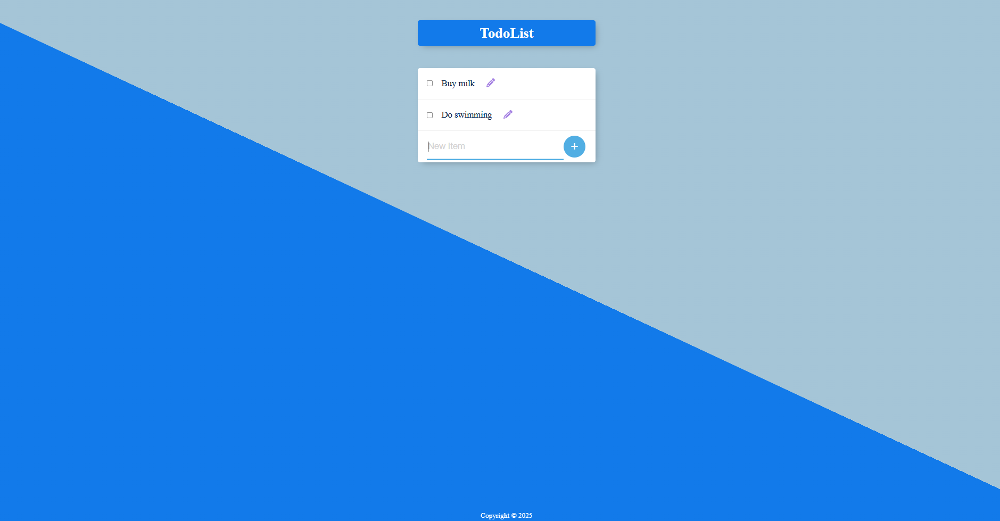
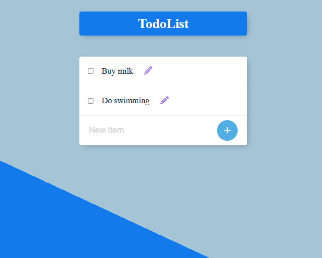
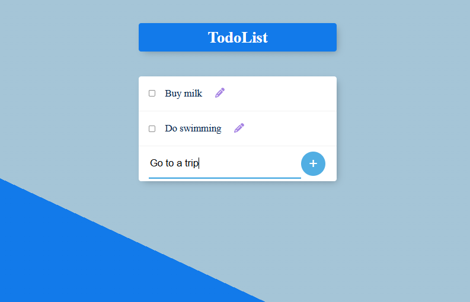
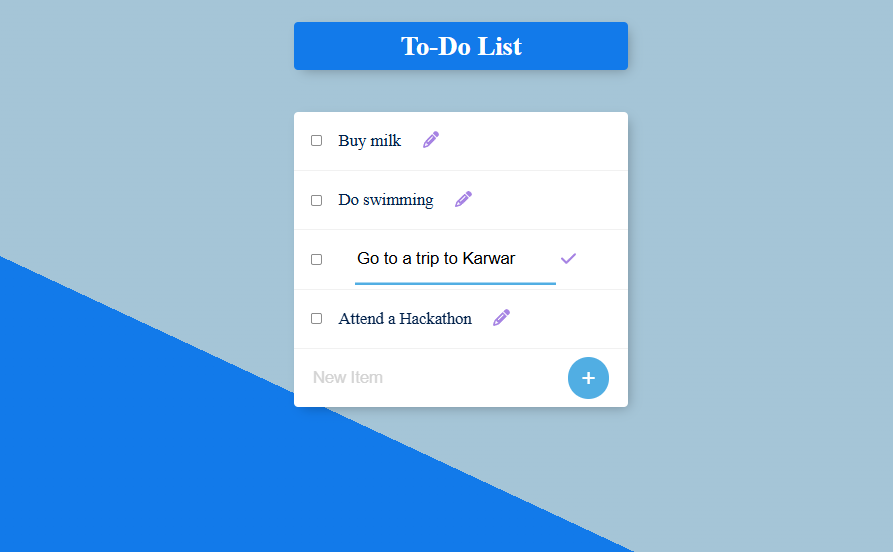
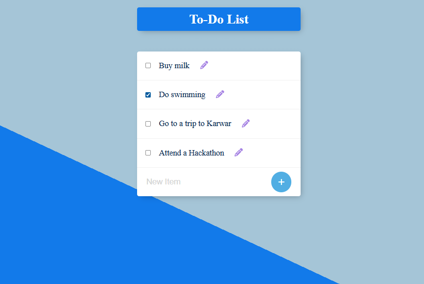
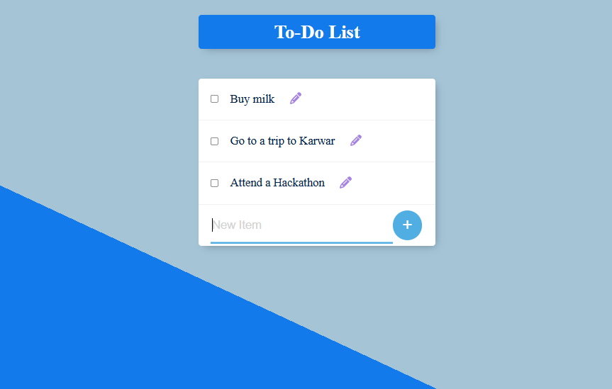

✅ Permalist – Your To-Do List Manager 📝
---
Permalist is a lightweight to-do list application built with Node.js, Express, EJS, and SQL. It allows users to add, edit, and delete tasks with a clean and responsive interface. The app uses partials for a reusable header and footer, SVG icons for actions, and a persistent SQL database to ensure tasks are saved permanently.
---
## 📷 Gallery

| UI | To-do List|
|--------|--------|
|  |  |

| Add To-do List| Edit To-do List|
|--------|--------|
|  |  |

| Delete To-do List| After Delete To-do List|
|--------|--------|
|  |  |
---

 1️⃣ Create Table in PostgreSQL(items):
 <br><br>
as given in the query.sql
 <br>
 
2️⃣ Install Dependencies:
```bash
npm i
npm i pg express ejs body-parser
```

3️⃣ Database Connection (index.js)
```bash
const app = express()
const db = new pg.Client({
  user: "postgres",
  host: "localhost",
  database: "XXXXX",    // <-- your database name
  password: "XXXXX",    // <-- your password
  port: XXXX,           // <-- your port name, by default for pg 5432
});
```
4️⃣ Run Server:
```bash
node index.js
```
---
👉 [Open App on Localhost](http://localhost:3000)
